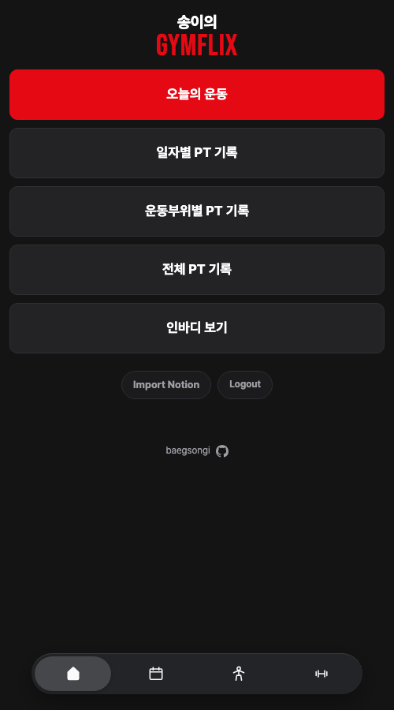
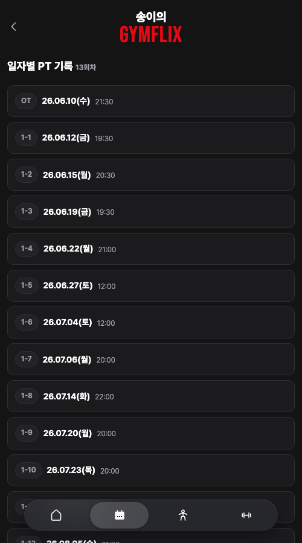
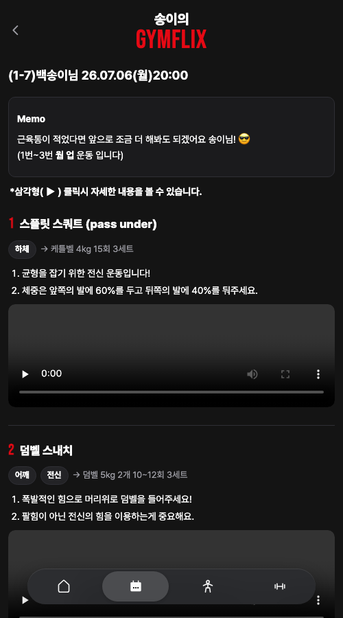
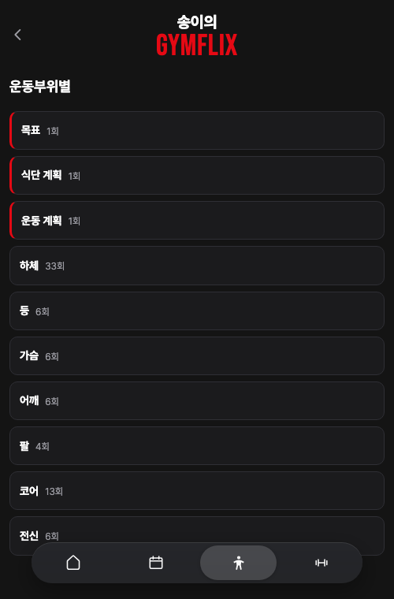
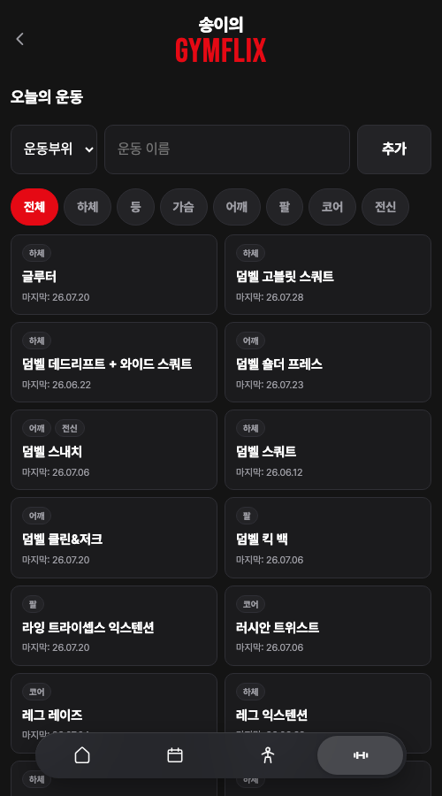
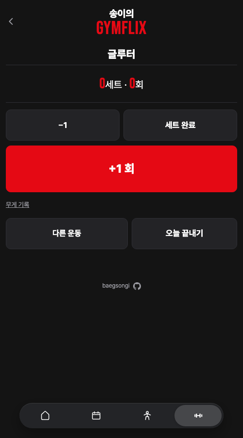

# 송이의 GYMFLIX

### 미리보기

| 홈 | 일자별 | 회차 상세 |
|---|---|---|
|  |  |  |

| 운동부위별 | 오늘의 운동 | 카운터 |
|---|---|---|
|  |  |  |

---

## 기능

**노션 기록 가져오기**
Craft 공유 링크나 노션 페이지 주소를 붙여넣으면 그 안의 회차를 통째로 읽어옵니다.
글은 몇 초 만에 들어오고, 동영상과 이미지는 뒤이어 나눠서 내려받습니다.
받는 도중에 창을 닫아도 됩니다. 다시 들어오면 받던 곳부터 이어갑니다.

**세 가지로 들여다보기**
- **일자별** — 회차 카드를 눌러 그날 한 운동과 영상을 봅니다
- **운동부위별** — 하체·등·가슴·어깨·팔·코어·전신으로 묶어서 봅니다.
  부위는 운동 이름에서 자동으로 정해지고, 한 운동이 두 군데 걸치면 양쪽에 다 들어갑니다
- **전체** — 처음부터 끝까지 한 화면에서. 위에 목차가 있어 원하는 날짜로 바로 갑니다

**오늘의 운동**
운동을 고르고 `+1 회`를 누르면 됩니다. 세트가 끝나면 `세트 완료`, 다 하면 `오늘 끝내기`.
무게는 필요할 때만 펼쳐서 적습니다. 잘못 눌렀으면 `−1`이나 세트 줄에서 고칩니다.
목록에 없는 운동은 부위를 고르고 이름만 적으면 그 자리에서 만들어집니다.

**인바디 바로가기**
버튼을 누르면 아이폰에서는 인바디 앱이 바로 열리고, 앱이 없거나 데스크탑이면 App Store로 갑니다.

---

## 문서

| | |
|---|---|
| [설치 · 운영](docs/setup.md) | 요구 환경 · 설치 · 권한 · 백업 · 테스트 · 구조 · 보안 |
| [결정 기록](docs/decisions.md) | 만들면서 바꾼 것과 그 이유 |
| [인계 문서](docs/2026-08-12-health-php.md) | 설계 배경, 확인해둔 노션 API 형식과 함정 |
